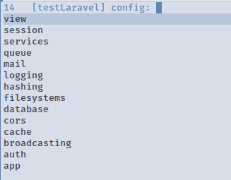
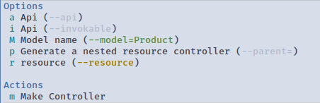
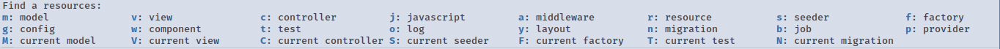

# Projectile Laravel

**Projectile Laravel** is a minor mode for working with [Laravel](http://laravel.com/) projects in GNU Emacs.
It is based on [Projectile](https://github.com/bbatsov/projectile).

With Projectile Laravel you are able to:

- navigate through laravel resources (controllers, models, views, helpers and so on)

  

- create those resources using magit like interface

  

- jump to php classes and template files
- run repl `php artisan tinker`
- run db console `php artisan db`
- run development server `php artisan serve`
- npm install
- composer install
- open log files with `auto-revert-mode` on
- see laravel keywords highlighted(WIP)
- Goto views & controller from routes/\*.php (WIP)

## Setup

### Installation

#### Melpa

Didn't added yet :(

#### Use package with straight.el

```emacs-lisp
(use-package projectile-laravel
  :straight (projectile-laravel :type git :host github :repo "strikerlulu/projectile-laravel"))
```

#### doom-emacs

Just add this to your _package.el_

```emacs-lisp
(package! projectile-laravel :recipe (:host github :repo "strikerlulu/projectile-laravel"))
```

## Usage

### The global mode

Use the package as a global mode:

```emacs-lisp
(projectile-laravel-global-mode)
```

### Customizing

#### Keywords(WIP)

The mode's buffers will have the Laravel keywords highlighted. To turn it off:

```emacs-lisp
(setq projectile-laravel-add-keywords nil)
```

#### Snippets

There are some laravel snippets in [doom-snippets](https://github.com/hlissner/doom-snippets/tree/master/%2Bphp-laravel-mode)

#### ANSI Colors

By default the buffer of the `projectile-laravel-server-mode` is applying the ansi colors. If you find it slow you can disable it with:

```emacs-lisp
(setq projectile-laravel-server-mode-ansi-colors nil)
```

### Keymaps

```emacs-lisp
(define-key projectile-laravel-mode-map (kbd "C-c l") 'projectile-laravel-command-mode-map)
```

You might want to create your own keybinding for your favorite commands. For example:

```emacs-lisp
(define-key projectile-laravel-mode-map (kbd "C-c m") 'projectile-laravel-find-model)
(define-key projectile-laravel-mode-map (kbd "C-c c") 'projectile-laravel-find-controller)
(define-key projectile-laravel-mode-map (kbd "C-c v") 'projectile-laravel-find-view)
(define-key projectile-laravel-mode-map (kbd "s-RET") 'projectile-laravel-goto-file-at-point)
(define-key projectile-laravel-mode-map (kbd "C-c g") 'projectile-laravel-mode-goto-map)
```

#### [hydra](https://github.com/abo-abo/hydra)

The name of the hydra is `hydra-projectile-laravel`. You can bind it to your preferred key

```emacs-lisp
(define-key projectile-laravel-mode-map (kbd "C-c l") 'hydra-projectile-laravel/body)

;;if you want...
(define-key projectile-laravel-mode-map (kbd "C-c f") 'hydra-projectile-laravel-find/body)
(define-key projectile-laravel-mode-map (kbd "C-c j") 'hydra-projectile-laravel-generate/body)
(define-key projectile-laravel-mode-map (kbd "C-c g") 'hydra-projectile-laravel-goto/body)
(define-key projectile-laravel-mode-map (kbd "C-c r") 'hydra-projectile-laravel-run/body)
```

### Which key



### Other useful packages for laravel dev

[web-mode](https://github.com/fxbois/web-mode)

### Inspired from

[projectile-rails](https://github.com/asok/projectile-rails)
